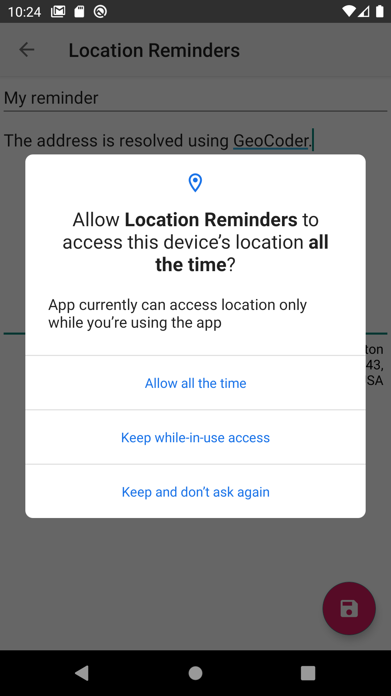

<h1> Project: Location Reminder </h1>

In this project, I created a TODO list app with location reminders that remind the user to do something when the user is at a specific location. The app will require the user to create an account and login to set and access reminders.

 

<h2> Enhanced functionality </h2>

 Besides the project requirements, I completed some additional tasks: 

<ol>
<li> Used MediatorLiveData. I converted "showNoData" to MediatorLiveData in order to automatically combine the values of "error" and "empty". "invalidateShowNoData" function is no longer needed. </li>
<li> A GeoCoder is used to get the address from the coordinates, if possible. </li>
<li> Upgraded deprecated code to up to day code where possible.
   <ul>
   <li> setHasOptionsMenu -> addMenuProvider. </li>
   <li> requestPermissions() -> RequestPermission contract. </li>
   </ul>
</li>

<li> After login, require location service enabled on the device in every fragment.</li>

<li> Apply limit of 100 reminders. This is the official geofence limit for a single app, single user. If there are 100 geofences, a message is displayed when the user clicks the “Add geofence” button. </li>

<li>Experimented with string interpolation (max_geofences_reached).</li>

<li>Suppressed meaningless warning (@Suppress("UNCHECKED_CAST”)).</li>

<li>Code refactored for extensive error handling.</li>

<li> Added this readme file and some screenshots.</li>
</ol>

<h2>Notes</h2>

<ol>
<li> Long click on a reminder to delete it and remove the geofence.</li>
<li> If the geofence is not activated using the emulator:
<ul>
   <li> Go to the application settings and set "Battery optimization" to "Not optimized" </li>
   <li> Go to the save reminder screen and then on the map. While the map is open, the app receives location notifications. </li>
</ul>
</ol>
<h2> Screenshots </h2>

<figure>
    
    <figcaption>Start screen.</figcaption>
</figure>
 
<figure>
    
    <figcaption>Login screen.</figcaption>
</figure>
 
<figure>
    
    <figcaption>Reminders list. No reminders added yet.</figcaption>
</figure>
 
<figure>
    
    <figcaption>Add new reminder screen.</figcaption>
</figure>
 
<figure>
   
   
   
   
   <figcaption>Select location. There are four map Types (Normal, Hybrid, Satellite, Terrain).</figcaption>
</figure>
 
<figure>
    
    <figcaption>Add new reminder screen. A location is selected. The address is resolved from the coordinates using a GeoCoder.</figcaption>
</figure>
 
<figure>
    
    <figcaption>When the user click the save button the background location permission is requested, if it not already enabled.  </figcaption>
</figure>
 
<figure>
    
    <figcaption>Reminder list  </figcaption>
</figure>
 
<figure>
    
    <figcaption>After a geofence is triggered a notification is triggered. When the user clicks on the notification, the details of this reminder are displayed. </figcaption>
</figure>
 
<figure>
    
    <figcaption>Integration test passed!</figcaption>
</figure>
 
<figure>
    
    <figcaption>All the unit tests (14 of 14) passed! </figcaption>
</figure>
 